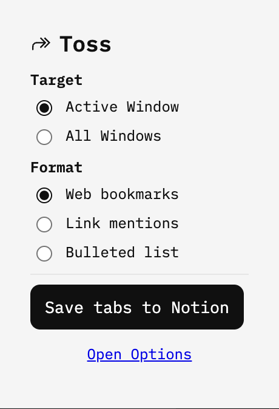

# ↱ Toss

## Send Tabs → Notion
A minimalist Chrome (MV3) extension that exports your open tabs to Notion — either as a new sub-page with **web bookmarks**, **link mentions**, or a **bulleted list**, or as a **database** where each tab is a row.

## Features
- One-click: capture tabs from your browser
- Selectable target: **Active Window** or **All Windows**
- Four formats: **Bookmarks**, **Link mentions**, **Bulleted list**, **Database (rows)**
- Requires a chosen **Parent Page** in Notion (new pages/databases are created underneath it)
- Clean UI (IBM Plex Mono), privacy-friendly (no servers)

## Install (Unpacked)
1. Clone this repo and open it in Chrome:
   - Go to `chrome://extensions`
   - Enable **Developer mode**
   - Click **Load unpacked** and select the project folder

2. Set up your Notion integration:
   - Create an internal integration at https://www.notion.so/profile/integrations
   - In the new integration’s **Access** tab, add the **Parent Page** you want to use
   - Copy the integration **secret token** (`secret_...`)
   - Open the extension **Options** in Chrome and paste the token
   - In Notion, open the **Parent Page** → **Share** → **Copy link**
   - Paste the link into the extension **Options**

3. (Optional) Adjust the page title template (`Tabs – {{date}} {{time}}`)

## Usage
1. Click the extension icon in Chrome  
2. Pick a **Target** (Active Window or All Windows) and a **Format** (Bookmarks, Link mentions, Bulleted list)  
3. Click **Save tabs to Notion**  
4. A new sub-page is created under your chosen Parent Page in Notion with all your links

**Title variables:** You can use {{date}}, {{time}}, {{datetime}}, {{count}}, {{target}}, {{activeTitle}} in the Page title template. The extension replaces them when creating the page/database.

## Permissions
- `tabs` (read open tabs’ titles/URLs)
- `storage` (save your token and preferences locally)

## Privacy
All data (Notion token, preferences) is stored locally via `chrome.storage.local`. No external servers.

## License
MIT

## Author
Jan Wysocki
